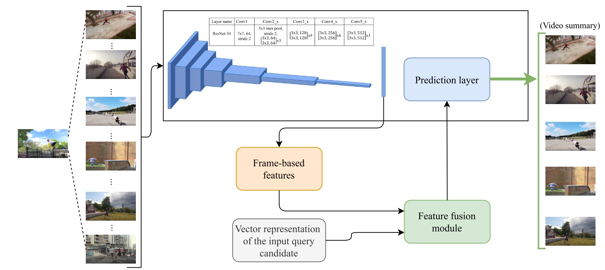

# Reproduction of Query-controllable Video Summarization  

Group 46 : 

Bingxiang Zhong (5449014) B.Zhong@student.tudelt.nl

## Introduction

Today, videos are integral way of exchanging and providing information. However, they are also extremely time consuming, as very often, they can contain redundant or useless information. Therefore, many video summarization algorithms have been created, that produce a fraction of the original file, by capturing only the essence of the video[1]. However, existing video summarization methods [2] produce a single fixed video, when what essential can change based on the user and the video. In order to address this problem, the research paper “Query-controllable video summarization” from Jia-Hong Huang and Marcel Worring designs a video summarization algorithm that takes a text-based query as an input before creating the video summary. Our goal in this blog is to replicate the results from the research paper, as well as adding additional features, like a new word embedding, and testing on new data.

The structure of the blog is as follows: First, we will present the model of the algorithm. This includes the neural network used, the word embeddings, and how we combined everything together. Continuing, we discuss the data processing. In particular, we will mention how we downloaded the frames in order to significantly speed up the execution time, how we extended the frames to 199, the majority vote rule used to determine a definitive annotation for each frame, and lastly, the formatting of the extra data in order for them to work with this algorithm. Next, we present the Methodology of the experiment.  Following, we present the results of the algorithm, which includes the outcome for the original data from the research paper, as well as the new data. Finally, we present a conclusion of our findings.

## Data preprocessing

### Data description

In the article, the dataset used by the author comes from [3], which contains 190 videos and the query texts. Each video is divided into images at one frame per second, and each image has 5 corresponding relevance scores. It was scored by 5 different people based on the query and the content of the image. The 190 videos are split into training/validation/test sets with a ratio of 60%/20%/20%, i.e. 114/38/38 respectively.

The dataset used by the author has completed frame segmentation, and the content of each frame is saved on the website, and the images can be directly accessed through the URL link. So we don't need to download the videos and split them into frames.

### Downloading images

In the existing code given by the author, they use the skimage package to get the image directly through the URL of the image. We first tried this method, but found that the training time for one round can be up to 6 hours, because each training needs to download the image from the URL link first, and then normalize and crop the image to make the training efficiency greatly reduced.

Therefore, we download all the images to the local computer first, and then perform subsequent operations on the pictures. We found that the training time for one epoch in this way is only about 15 minutes with GPU, which greatly improves the efficiency.

### Extend frames to 199

Since the duration of each video is different, the number of the corresponding frame is also different. The  figure below shows the original number of frames of each video. The x-axis denotes the video index and the y-axis indicates the number of frames.  We can see that the maximum number of frames is 199. For convenience, the authors  made all the videos have the same number of frames 199. To make all videos have the same number of frames, which is 199, we repeat the frames from the first frame until each video reaches a total of 199 frames.


						Figure 1 The original number of frames of videos. 

### Majority Vote

In this paper, the authors use the **majority vote rule**, [1, 14], to evaluate the model performance for a relevance score prediction, i.e., a predicted relevance score is correct if the majority of human annotators provided that exact score. Note that we map annotations, “Very Good” to 3, “Good” to 2, “Not Good” to 1, and “Bad” to 0. Every video in the proposed dataset is annotated by at least 5 different AMT workers, so each frame has five annotations. So we need to use the majority vote rule to obtain a final relevance score for each frame.

The detailed code is in `majority_vote.py`

### Mean rule

However, we discovered that taking the majority vote to decide the relevance score for every frame may be inaccurate. For example, if a frame has scores (0,0,1,2,3), using the majority vote gives us the 0 score. But there are 3 people here who think that the frame and query are related, and only 2 people think that there is no relationship at all. If the majority rule is followed, it should also be considered that the frame is related to the query. 

So we took the mean operation to determine the relevance score for each frame. We averaged the 5 scores corresponding to each frame and take the rounded integer as the final score. We will compare the results of using the mean rule and the majority vote in our experiments. 

### Normalization and cropping

Before putting the images into the model, we used the same settings in the existing code given to normalize each  image channel by *mean* = (0.4280, 0.4106, 0.3589) and std = (0.2737, 0.2631, 0.2601) and crop the image to 224x224 size.

## Model

The proposed method query controllable video summarization consists of a video summary controller, video summary generator, and video summary output module. Figure 2 presents the main idea of this method. First, a user can give a text-based query to the summary controller and then it will output the vector representation of the query. The summary generator takes the embedded query and a video as inputs and outputs the frame-based relevance score prediction. Finally, a video summary will be generated by the video summary output module based on the score prediction. 


			Figure 2 The flow chart of the query controllable video summarization model.

### Video summary controller

For video summary controller, the authors used one-hot embedding to obtain the vector representation of the query. Since all queries have a total of 352 words, we need a size of 1x352 to represent a word, which could be time consuming for processing these queries. 

In this project, we use Word2vec (Mikolov et al. 2013), a framework for learning word vectors, to represent each word by a vector such that it can best predict the surrounding words. While in the code provided by the author, the author didn't completely provide the embedding part. So we use Gensim, a free open-source Python library for representing documents as semantic vectors.  With this embedding approach, we only need a size of 1x100 to represent a word. For convenience, we also made all vector representations of the query have the same length of 8, as the authors did. Therefore, a query will be represented as the size of 1x100x8.

The implementation of our query embedding is:

```python
def embedding_model():
    # Load the queries from every dataset
    queries_test = pd.read_csv('query-VS/dataset/videos/video_name_test.csv', engine='python')
    queries_train = pd.read_csv('query-VS/dataset/videos/video_name_train.csv', engine='python')
    queries_val = pd.read_csv('query-VS/dataset/videos/video_name_val.csv', engine='python')

    # Stack train/val/test queries together
    df_queries = pd.concat([queries_train, queries_val, queries_test], axis=0)
    queries = df_queries.values.tolist()

    # Tokenize
    token = [word_tokenize(q[0]) for q in queries]

    # Build word2vec model
    model = gensim.models.Word2Vec(token, min_count=1)
    print(model)
    return model


def encode_queries(queries, model):
    emb = []
    for q in queries:
        word = q.split()
        emb.append(model.wv[word])
    return emb
```

### Video summary generator



						Figure 3 The structure of the video summary generator.

The video summary generator is composed of a convolutional neural network (CNN) structure and a multi-modality features fusion module. The CNN structure is used to extract features from the images, and it is based on the pretrained ResNet-34. By feeding an image of size 1x3x224x224 into the CNN structure, features of size 1x512 will be extracted. 

### Feature fusion module

The authors exploited 3 different commonly used feature fusion approaches, summation, concatenation, and element-wise multiplication, to fuse query and frame-based features. However, in the existing code, this part is missing and we also use a different word embedding method from the paper, the embedded query vector's dimension is changed. So some changes to the code are required. 

As mentioned before, a frame-based feature is 1x512 dimension, and the video summary controller will output a vector representation of dimension 1x100x8 for each query. In order to conduct element-wise multiplication and summation to fuse query vector and frame-based features, the dimensions of query vector and image feature should be equal. 

We define two linear layers to transform the dimension of the query to 1x512, which is shown as follows

```python
self.fc_text1 = torch.nn.Linear(8, 1)
self.fc_text2 = torch.nn.Linear(100, 512)
```

The query vector is first used as the input of the first linear layer, followed by a ReLU activation layer. The output at this time will be flattened, and then pass through the second linear layer and a ReLU activation layer, and finally get a query vector of 1x512 size. Now, the query vector and the image feature have the same size. We can implement element-wise multiplication and summation easily. 

But for the concatenation, we concatenate the frame-based feature and the query vector are the second dimension. This outputs a 1x1024 size feature instead the previous 1x512. So the final prediction layer should be defined with 1024 input features and 4 output features (as we are going to predict 4 scores of the frame). 

Here is the complete code for the query controllable video summarization model. 

```python
class QVSmodel(nn.Module):

    def __init__(self):
        super(QVSmodel, self).__init__()

        self.model = resnet34(pretrained='imagenet')
        self.model = models.resnet34(pretrained=True)
        self.fc1 = torch.nn.Linear(512, 4)
        self.fc2 = torch.nn.Linear(512*2, 4)

        self.fc_text1 = torch.nn.Linear(8, 1)
        self.fc_text2 = torch.nn.Linear(100, 512)


    def forward(self, x, y):
        x = self.model.conv1(x)
        x = self.model.bn1(x)
        x = self.model.relu(x)
        x = self.model.maxpool(x)
        x = self.model.layer1(x)
        x = self.model.layer2(x)
        x = self.model.layer3(x)
        x = self.model.layer4(x)

        x = F.avg_pool2d(x, 7)

        # reshape x
        x = x.view(x.size(0), -1) # output is (1, 512)

        y = F.relu(self.fc_text1(y))
        y = y.view(y.size(0), -1)
        y = F.relu(self.fc_text2(y))


        t1 = torch.mul(x, y)
        # summation
		# t1 = x + y
        # concatenation
		# t1 = torch.cat((x, y), 1)

        # Computes the second fully connected layer
        relevance_class_prediction = self.fc1(t1)
        
        # for concatenation use the code below
		# relevance_class_prediction = self.fc2(t1)

        return relevance_class_prediction
```


## Experiments and Results

### Experiments Setup

We adopted the experimental setup as in the original paper. The loss function is set to cross entropy, the optimization algorithm is set to Adam algorithm, and the learning rate is 0.0001. Considering the memory limitation, we set the batch size to 64, while in the paper it is set to 199.  

We use Google Cloud Platform to set up a virtual machine, and we use 1 x NVIDIA Tesla T4 to train our model. 

### Training and validation

We first took the majority rule on the data and trained the model for 25 epochs. The change in the accuracy of the training set and the accuracy of the validation set is shown in the figure below, which shows the same pattern as the change of the accuracy in the paper. When the number of epoch increases, the training accuracy keeps improving, while the validation set accuracy even decreases slightly, and the model appears to be overfitting. At the same time, the accuracy of the validation set is small compared to the accuracy in the paper, only about 0.45.


Comparing the results of Fig1 to Figure 5 from the paper, we see that our model converges to the final result in less epochs compared to the original paper. This is beneficial, as it allows us to get a good result in less epochs. However, looking at the final results, we see a slightly larger difference between the accuracy of the training and validation data. This indicates that our model slightly overfits when compared to the original paper.


### Testing

As we can see from the accuracy curve , the training epochs increase, and the validation set accuracy does not improve much. So on the test set, we only train the model for 3 epochs, and then calculate the test set accuracy.

We first process the relevance scores of the data with the majority rule, and train on the processed data. The figure 4 below shows the accuracy of the test set under different fusion methods. 

There is a certain gap between this accuracy and the original paper. The accuracy of the original paper can reach 0.6, while ours is only 0.5 at most. This may be because we have made changes to the code of the provided model part, which may be different from those used by the authors, causing the results to be skewed. At the same time, due to the limitations of experimental conditions, the settings of some parameters are different from those in the paper, such as the setting of batch size.


```
Figure 4 The performance on the test dataset with three different fusion methods by using the majority vote.
```


It is also worth noting that in the paper, the authors found that the fusion method of multiplication is optimal compared to the others, and our experiments show that the fusion method of concatenation is optimal. This may be because in the implementation of the concatenation method, we added another linear layer and introduced more learning parameters, so that the model is more flexible and can capture more general features.

Then, we adopted the mean rule to deal with the relevance score. The experimental results are shown in the figure below. It can be seen that the accuracy of the test set under each fusion method is higher than that in the original paper. The fusion method of concatenation also has the highest accuracy, while the fusion method of multiplication has low accuracy. This means that processing the relevance score with the mean rule can truly reflect the relationship between the image content and the query, so that we can obtain higher accuracy.

It is also worth noting that in the paper, the authors found that the fusion method of multiplication is optimal compared to the others, and our experiments show that the fusion method of concatenation is optimal. This may be because in the implementation of the concatenation method, we added another linear layer and introduced more learning parameters, so that the model is more flexible and can capture more general features.


```
Figure 5 The performance on the test dataset with three different fusion methods by using the mean rule.
```


### Extra data

For the extra data, we used the TVSum Dataset (Yalesong, 2015). This dataset contains 50 videos, and 20 annotations of shot-level importance score per frame. The annotations were crowdsourced and are from a scale of 1 to 5. In order to fit these data to our algorithm, we would need a query. We decided to use the title of the video, as it provides a good summarization of what the essence of the video should be. Next, we followed a similar procedure in extracting the frames as the original paper. In particular, we extracted 1 frame per second, and a maximum of 199 frames per video. Continuing, we had to change the importance scale, as the scale of the original data ranged from 0 to 3. In order to solve this issue, we shifted the scores down by 2, and combined the two bottom scores into one. Lastly, the new data were not split into clusters, like the original ones. To address the issue, we took the decision for each cluster to represent an interval of 10 seconds in the video.

### Testing on extra data

When testing on the extra data, the accuracy was low, at 13%, and did not increase over many epochs. However, when splitting the new data into a train and test dataset, the accuracy was 73%, after 1 epoch, and it did not increase over many epochs. The low accuracy when used for testing, combined with the high accuracy when being split to training and testing indicates that the annotation data do not represent the videos in the same way that the original data did. This could be a result of different questioning during the creation of the annotations, combined with the fact that the title was not always an appropriate query, as many times, it failed to encapsulate the essence of the video. However, we believe the biggest contributor to this lack of success was the lack of clustering data.

## Conclusion
In this project, we aim to reproduce the paper **Query-controllable Video Summarization** and improve the performance by using different data processing methods and algorithms. First, we use the Word2vec to embed the query instead of the one-hot embedding.  Second, we implement the mean rule to process the relevance sorce, and the accuracy is improved by using this method. Finally, we apply this model to test the new data. We find that the trained model performs poorly on the new data, but training the new data with this model results in higher accuracy.
Although the lack of important parts of the code like the query encoding and the fusion module made the process of replicating the results much harder, after writing our own version to solve these problems, we were able to achieve results and even improved the results. 
Although this project was challenging, the experience allowed us to further understand the workings of end-to-end deep learning algorithms. Furthermore, this project also allowed us to better understand the importance of replicability of research papers.

## Contributions
Our workflow consisted of meetings where we would discuss and try to address our biggest tasks for that week. Each person was also responsible for certain individual contributions, in particular:
 - Angelos worked on understanding the data formatting, exploring new annotated data, and translating them so they work with the algorithm.
 - 
 Bingxiang worked on preprocessing the data, training the model and the fearture fusion module. 


## Reference

[1] Boqing Gong, Wei-Lun Chao, Kristen Grauman, and Fei Sha. 2014. Diverse sequential subset selection for supervised video summarization. In Advances in Neural Information Processing Systems. 2069–2077.

[2] Wen-Sheng Chu, Yale Song, and Alejandro Jaimes. 2015. Video co-summarization: Video summarization by visual co-occurrence. In Proceedings of the IEEE Conference on Computer Vision and Pattern Recognition. 3584–3592

[3]Arun Balajee Vasudevan, Michael Gygli, Anna Volokitin, and Luc Van Gool. 2017. Query-adaptive video summarization via quality-aware relevance estimation. In *Proceedings of the 25th ACM international conference on Multimedia*. ACM, 582–590.

[4] Yalesong, (2015). GitHub - yalesong/tvsum: TVSum: Title-based Video Summarization dataset (CVPR 2015). GitHub. Retrieved April 14, 2022, from https://github.com/yalesong/tvsum

